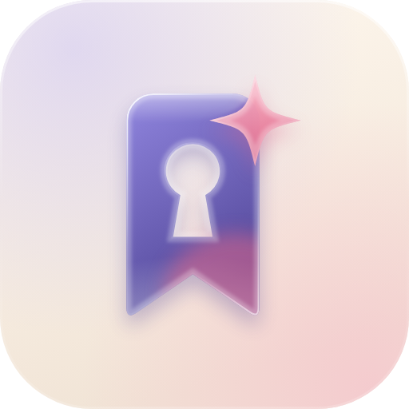
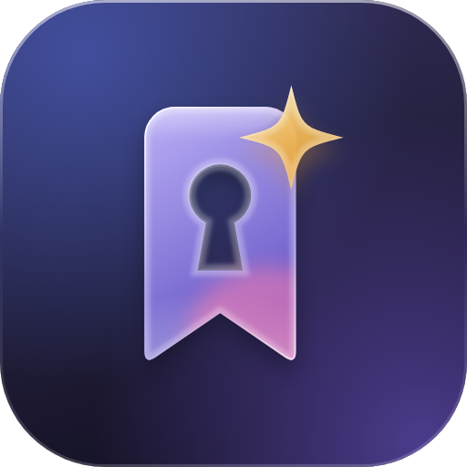

# 玻璃 app 图标 v4（废案）

定稿用的是 R6（见 [`../../logo-kit/`](../../logo-kit/README.md)）。这一版留作参考：它比 R6 更饱和、更「糖果玻璃」，书签带一点角色感的粉色内光。

| 白天 | 夜间 |
| --- | --- |
|  |  |

`python build.py` 会重新生成 `icon-light.svg` / `icon-dark.svg`（与原稿逐字节一致，只是换行改为 LF）。PNG 是 512 px 的 Chrome 渲染。

## 构造

1024 画布，圆角矩形 `rx=230` 裁切全部内容。从后到前：

1. **底板**：竖向线性渐变（白天 `#FFF9F0 → #F1E4D6`，夜间 `#35305C → #151326`），叠两团 55% 不透明度的径向光：左上一团、右下一团，颜色互补（白天紫 `#C9C0F2` / 粉 `#F7B7C8`，夜间紫 `#7A5CE0` / 蓝 `#4F6BD8`）。
2. **书签与星星**统一放在 `translate(150 182) scale(2.6)` 的 256 网格里，两者共用同一个 `glass()` 配方：
   - **投影**：同形状，主色，30–35% 不透明度，高斯模糊 9，下移 10。
   - **玻璃体**：两色斜向渐变，92–95% 不透明。书签 `#8F84E0 → #4A3F96`（夜间 `#C4B8FF → #6D5DD3`），星星 `#FFC2D1 → #E0688A`（夜间 `#FFE39A → #E39A2C`）。
   - 以下效果都裁切在形状内部：
     - **焦散**：底部白色径向光，55% → 0。
     - **顶部高光**：椭圆 `80 × 26`，白色向下淡出，轻微模糊。
     - **内光（只有书签）**：右下角粉色椭圆（夜间 `#FF7FAE`），55%，模糊 9。
     - **软边**：10 宽的白色描边，28%，模糊 1.6，形成玻璃厚度。
     - **硬边**：3.2 宽的对角渐变描边，左上 95% 白，向中段淡到约 5%，右下回到 60%。
3. **底板边缘**：6 宽的描边，上沿 55% 白，下沿 18% 白，模拟边缘反光。

### 与定稿几何的差异

- **书签**改成更软的轮廓：顶角 `r=26`（定稿 18），底部两个尖角用二次曲线收圆（`Q192 238 182 231`），V 口深度不变。锁孔与定稿一致。
- **星星**：中心 `(188, 46)`，半径 44，收腰系数 0.2（定稿 0.16，更胖）。在 256 网格里位置更靠近书签右上角。
- 没有单独分层文件，也没有小尺寸版。若要复活，应按 R6 的方式拆成 背景 / 书签 / 星星 三层，并沿用 kit 的扁平小尺寸版。
