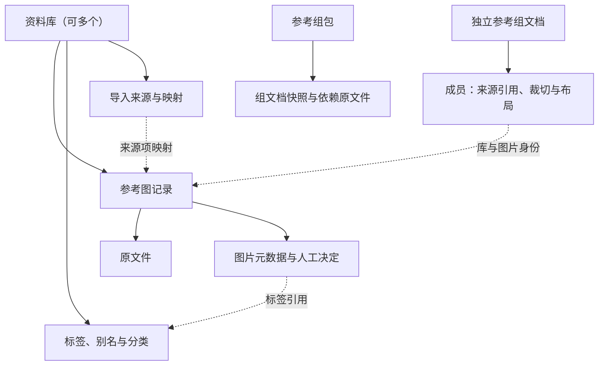

# 数据层级与存储关系

2026-10-01。原图与元数据归库、参考组独立、成员状态独立及带原图的包已确认。本轮明确合并冲突的查找行为、桌面局部边界及备份向导的组织方式；下列归属保持不变，具体格式与跨库备份范围仍属提案。身份与操作规则见 [数据与存储模型提案](data-storage-model.md)。

## 归属与引用

实线表示归属，虚线表示引用。对象不要求各有一张表或一个目录。



- 每个资料库拥有自己的图片及元数据，完整本地目录可整体迁移。
- 标签字典、别名、分类与导入映射属于库；相同原图在不同库中可以有不同整理结果。
- 普通参考组保存引用，可跨库取图；同图的多次使用分别保存成员状态。
- 需要脱离原库使用时生成带原图的参考组包。

## 建议的存放职责

```text
资料库目录
├─ 一个权威 SQLite：库身份、格式版本、图片元数据、字典与映射
├─ 原文件：相对库根目录存放
├─ 需保留的派生结果：超分的规划位置
└─ 可重建缓存：缩略图、检索索引与显示缓存

独立参考组目录
└─ 带版本的组文档（建议 JSON）
   ├─ 成员来源与原图裁切
   ├─ 各成员的画布位置与显示比例
   └─ 组画布视口

导出的参考组包
├─ 组文档快照与依赖清单
└─ 依赖的原文件
```

库身份由库内 SQLite 保存；设备配置登记库／组的位置及桌面窗口状态。提案建议用稳定库／图片 ID 引用记录，用原文件哈希校验内容，搬目录不改变身份。成员的位置、尺寸与缩放需要恢复，具体字段由显示原型验证；桌面钉图不修改局部边界。

## 合并、撤销与保护范围

- **已确认**：A、B 合并生成 C，保留 A、B；完全相同原图在 C 中合并记录并汇合元数据，相似图与不同版本保留。
- **已确认**：移除保留文件，删除先可恢复；备份恢复形成独立库；备份、持续同步及超分进入 roadmap。
- **已确认**：合并向导先展示相反的人工标签决定；用户跳过时保留双方决定和冲突标记，添加标签继续参与查找。普通人工否决仍按正常规则排除标签。
- **已确认**：合并后预览受影响组，经用户确认重连现有组到 C，保存重连前备份；组身份保持不变。
- **已确认**：备份向导以资料库及关联参考内容组织范围，应用自动纳入相关组，不要求用户单独勾选组文件。此保护范围不改变参考组独立保存的归属。
- **建议**：撤销删除沿用身份，独立恢复生成新库身份；库备份包括可恢复删除内容。独立恢复后的参考组连接另行明确。
- **建议**：原文件与必要映射完整后，C 可以带明确的整理冲突清单可用；备份应验证组的原图依赖。

跨库依赖需要向导提示，补选完整外库还是只携带依赖图片仍待确认。包的元数据范围、备份交付阶段与格式验证也尚未确定。Eagle 重导、中断边界及检查场景见 [模型提案](data-storage-model.md)。
