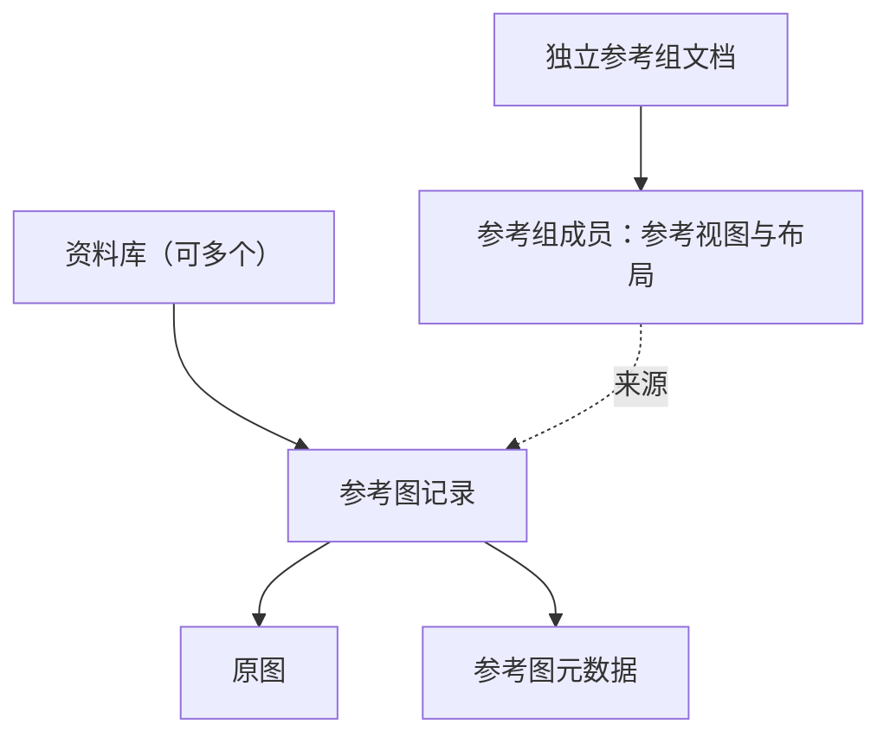

# 数据层级与存储关系

## 归属与引用

实线表示归属，虚线表示引用。



- 每个资料库拥有自己的原图及元数据，完整本地目录可整体迁移。
- 参考组可以引用多个资料库的图。每个成员独立保存裁切、位置、尺寸和缩放，并继续关联原图；在一个组中修改不影响另一个组。

## 本地存放层级

以下为概念目录。本地是主要使用方式，远端存储的接入方式待定。

```text
存储位置
├─ 资料库 A
│  ├─ 原图
│  ├─ 参考图元数据、标签与别名
│  ├─ 保存的参考视图
│  ├─ 图像派生版本（超分的规划位置）
│  └─ 可重建缓存
├─ 资料库 B
│  └─ 同样的库内层级
└─ 参考组文档
   ├─ 成员与来源引用
   └─ 各成员的裁切与布局
```

## 合并与恢复

- A、B 合并生成 C，并保留 A、B。
- C 中完全相同的原图合并为一条记录并汇合元数据；相似图和不同版本各自保留。
- 备份恢复生成独立资料库。

备份、持续多设备同步和超分均在 roadmap。超分派生版本仅预留规划位置，尚未制定规格。

## 未决项

- 合并时的元数据冲突处理。
- 来源缺失时的行为，以及资料库迁移、合并或恢复后的引用迁移。
- 参考组打包方式与备份范围。
- 具体文件格式与存储后端。
