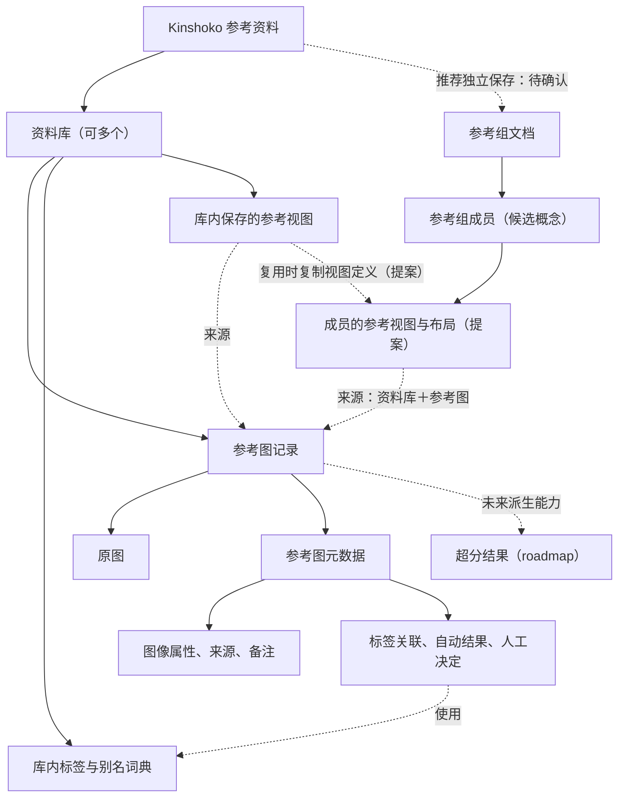
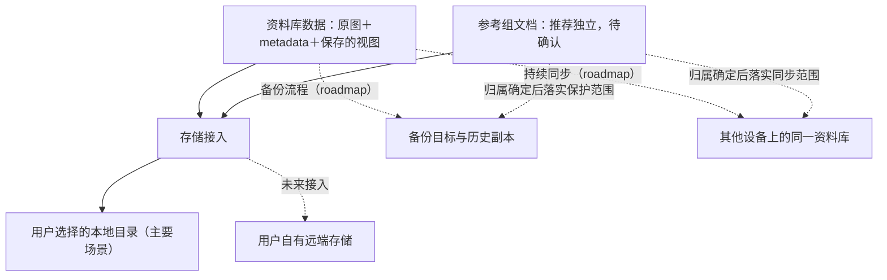

# 数据层级与存储关系草案

2026-10-01。用于对齐 Kinshoko 的领域关系。参考组的独立文档方案、成员的独立状态以及合并去重规则仍是提案；本文没有选定数据库、文件格式、同步协议或远端服务。

## 已确认的边界

- 用户可以建立多个资料库，每个库拥有自己的图片及 metadata。本地库按已推荐的完整目录方式保存，能够整体迁移；日常检索默认针对当前库。
- A、B 合并时生成 C，保留 A、B；需要时再单独删除原库。
- 从列表移除保留文件；删除资料库进入可恢复状态，永久删除另作明确操作。
- 恢复备份默认形成独立资料库，之后可主动合并。
- 自动标签直接参与检索，人工添加、修改和否决优先，模型重新识别保留人工决定。
- 保存参考组的成员关系及位置、尺寸、缩放；参考组归属仍待确认。
- 首版整图与局部参考以原图像素为清晰度基准，支持 1:1 查看与缩放。图片超分辨率必须在 roadmap 中预留工作。

## 数据归属与引用

实线表示包含关系；虚线表示引用、复用或图中注明的未来能力。带“提案”“待确认”的节点和关系尚未采用。



资料库保存素材及其整理信息。某张图的标签关联属于该图的 metadata，库内标签名称与别名的定义可集中维护；多个图片记录可以使用同一个标签。

上图推荐让参考组成为可独立保存的文档。组里的成员记录来源以及这次使用的裁切、位置、尺寸、缩放。原图仍归原资料库所有，参考组可以组合来自多个库的图。库内保存的局部参考可以作为复用入口，创建组内成员时复制视图定义；这一成员关系还需 Q21 确认。

“参考组成员”是候选概念，指某个参考视图在一个组中的一次使用。它的状态是否独立，尚未写入正式术语表。

## 参考组归属的选择

| 方案 | 有利之处 | 需要落实的边界 |
|---|---|---|
| 归属于某个资料库 | 随所在库保存、搬迁与备份 | 使用其他库的图时，需确定跨库引用或素材收纳方式 |
| 独立参考组文档（推荐） | 跨库组合、长期复用与单独分享自然 | 需管理来源依赖，并设计打包、恢复及来源缺失的行为 |

建议采用独立文档。例如，“眼睛参考组”可以组合人物库 A 和色彩库 B 的局部。它可以被单独保存；库 A、B 继续拥有各自素材及 metadata。

普通保存是否仅保留引用、导出或备份是否打包所用原图，要在归属确定后选择。独立文档不等于已经包含全部依赖素材。

## 本地存放层级

这是概念分区，具体目录名称和文件格式尚未确定。

```text
用户选择的存储位置
├─ 资料库 A
│  ├─ 原图
│  ├─ 库内持久信息
│  │  ├─ 参考图 metadata 与人工整理决定
│  │  ├─ 标签与别名词典
│  │  └─ 保存的参考视图
│  ├─ 图像派生版本（超分能力的规划位置）
│  └─ 可重建缓存（预览、检索索引等）
├─ 资料库 B
│  └─ 同样的库内层级
└─ 独立参考组位置（推荐，待确认）
   └─ 参考组文档
      ├─ 成员与来源引用
      └─ 各成员的裁切与布局
```

建议把原图、metadata、人工决定和保存的参考内容作为持久数据；缓存可以重建。超分结果拟作为关联原图的派生版本保留，具体版本信息、显示选择与局部坐标映射在超分规格阶段确定。

本机对库目录的登记用于找到数据。建议引用通过资料库及参考图的稳定身份关联，目录路径只是当前位置；搬迁资料库时能够更新位置。这是规划建议，尚未指定标识或登记格式。

## 存储、备份与同步



逻辑上的资料库与实际存放位置分开规划。本地是主要使用场景，远端存储、备份目标与其他设备的同步副本分别保留接入位置。

备份恢复产生独立资料库，是本轮已确认的行为；持续同步维护不同设备上的同一个逻辑资料库。恢复库的身份、内部关系及外部参考组引用如何接续，要在参考组归属确定后细化。

采用独立组方案时，库级备份、参考组文档备份与包含依赖素材的整套备份需要明确区分。不能把仅保存了组文档视为已保护原图。

## 用场景检验关系

| 场景 | 当前结论或待选规则 |
|---|---|
| 同一图片在 A、B 中出现 | A、B 各自拥有整理信息；是否在合并后的 C 中合成一条参考图记录，待 Q22 确认 |
| “眼睛参考组”用了 A、B 的图 | 独立组方案可表达这组关系；归属等待 Q20 |
| 在组 H 中重新裁切、移动或缩放某个成员 | 推荐只影响 H 的这个成员，保留其他组的使用状态；等待 Q21 |
| 把 A 目录搬到新位置 | A 应仍可作为完整资料库打开；推荐更新来源位置后接续引用 |
| 把 A 从库列表移除 | A 的文件保留；引用是否自动查找未登记目录，需要后续规格 |
| 删除 A，而一个独立组仍引用它 | 来源缺失时如何保留成员、提示与恢复，依赖 Q20 的结果 |
| 恢复 A 的备份为 A-恢复 | 形成独立库；是否重新关联某个参考组需要用户选择的规则 |
| A、B 合并为 C 后准备删除 A、B | 需要落实相关参考组的来源迁移或素材打包，依赖 Q20 和 Q22 |

## 当前访谈问题

- **Q20：参考组归属**。独立文档还是归属于某个资料库？推荐独立文档，允许跨库组合。
- **Q21：成员状态**。同一局部用于 G、H 两个组，在 H 中重新裁切、移动、缩放时，是否独立于 G？推荐每次使用拥有自己的视图状态，来源继续关联原图。
- **Q22：合并去重**。A、B 中完全相同的原图进入 C 时，是合成一条参考图记录，还是保留两条？推荐仅对完全相同的原图合并记录并汇合 metadata；相似图或不同版本各自保留。具体元数据冲突和引用迁移在本轮选择后明确。

本轮确认后，再继续对齐来源缺失、跨库迁移与打包、相互矛盾的人工整理结果、备份范围及 Eagle 导入规则。领域访谈尚未完成。
