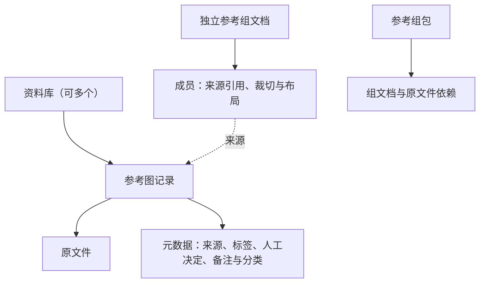

# 数据层级与存储关系

2026-10-01。本图保留已确认的归属，具体身份、操作规则与存储选择见 [数据与存储模型提案](data-storage-model.md)；提案中的新建议尚待验证与确认。

## 归属与引用

实线表示归属，虚线表示引用。



- 每个资料库拥有自己的图片及元数据，完整本地目录可整体迁移。
- 普通参考组保存引用，可跨库取图；成员各自保存裁切、位置、尺寸与缩放。
- 同一图的多次使用分别保存状态。在一个组中修改，不影响其他组。
- 需要脱离原库使用时生成带原图的参考组包。

## 建议的存放职责

```text
资料库目录
├─ 库身份与格式入口
├─ 原文件
├─ 图片记录与元数据（建议每库一个 SQLite）
├─ 需保留的派生结果（超分的规划位置）
└─ 可重建缓存

独立参考组目录
└─ 组文档（建议 JSON）：来源引用、成员裁切与布局

导出的参考组包
├─ 组文档与依赖清单
└─ 依赖的原文件
```

设备的库目录与远端位置用于定位数据。提案建议保留稳定库／图片身份，用完整文件哈希校验原图；位置变化不改变图片身份。参考视图的状态直接保存到成员，无须额外的库内“保存视图”目录。

## 合并与保护范围

- **已确认**：A、B 合并生成 C，并保留 A、B；C 中完全相同的原图合并记录并汇合元数据，相似图与不同版本保留。
- **已确认**：备份恢复形成独立资料库；备份、持续多设备同步与超分都进入 roadmap。
- **建议**：合并与恢复输出引用映射，已有组不自动改连；来源不可用时保留成员状态。
- **建议**：库备份与独立参考组分别列明保护范围；可独立恢复的组备份需要带齐原图依赖。

待定的是元数据冲突、包的元数据范围、备份交付范围与格式验证。详细取舍、Eagle 重导规则和检查场景见 [模型提案](data-storage-model.md)。
