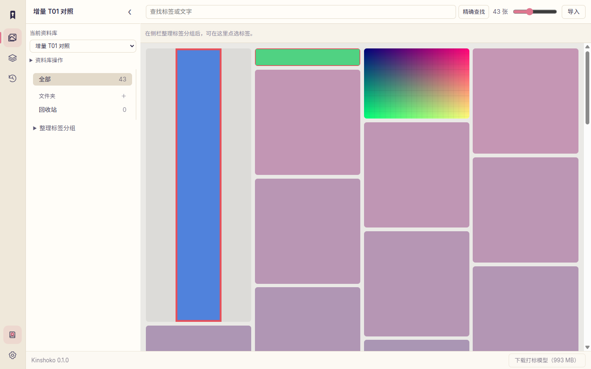
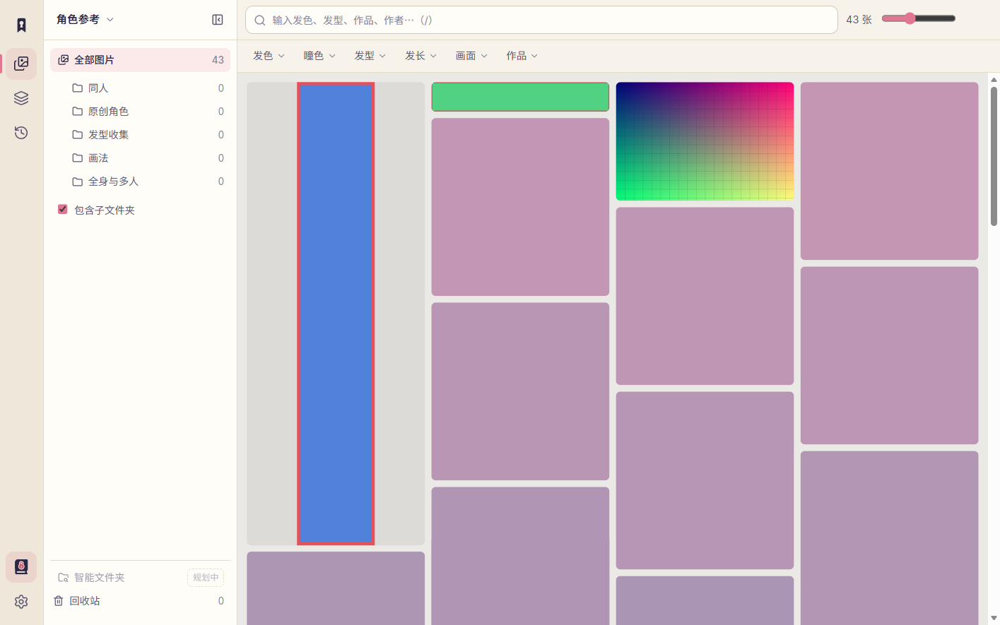
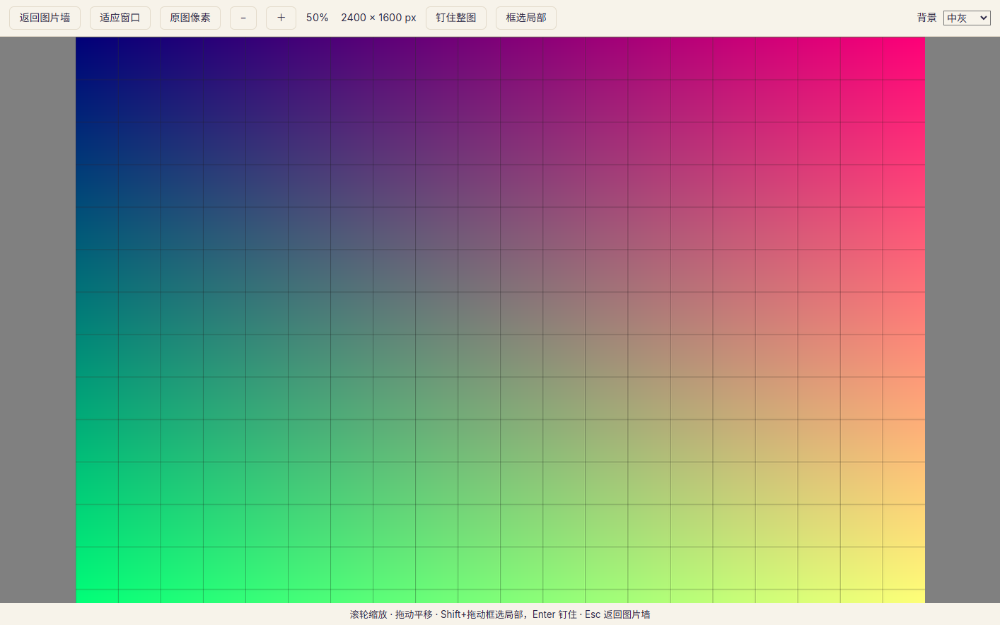
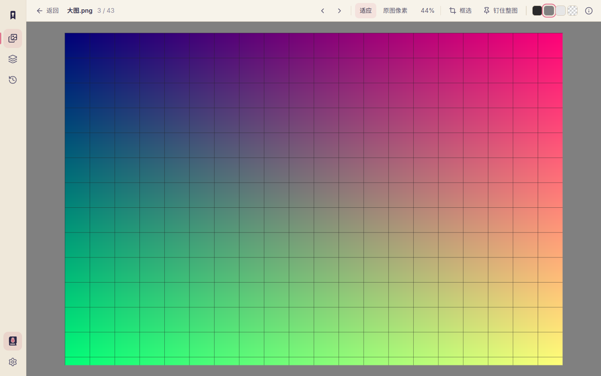
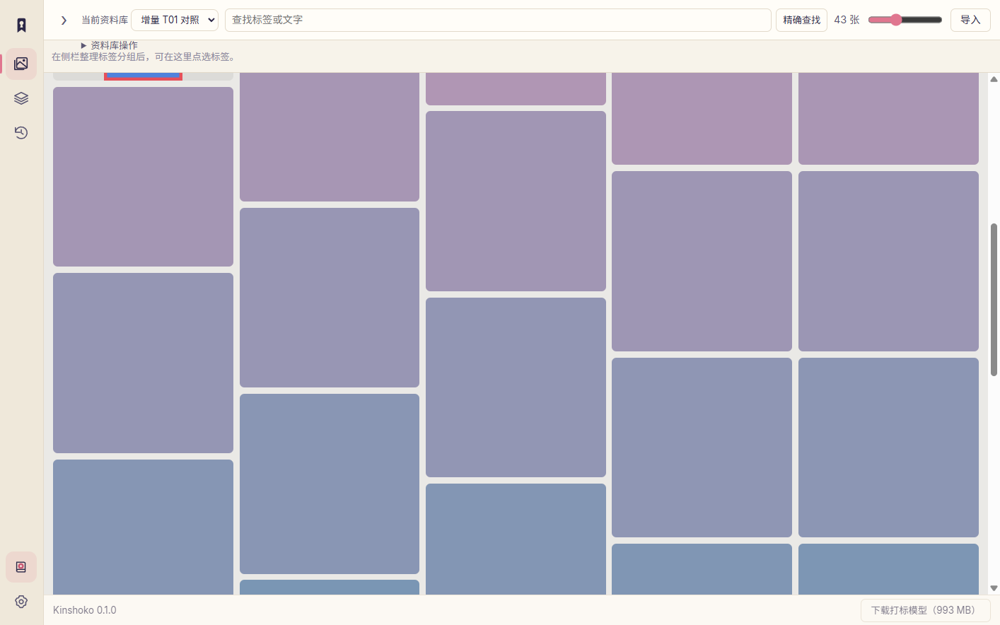
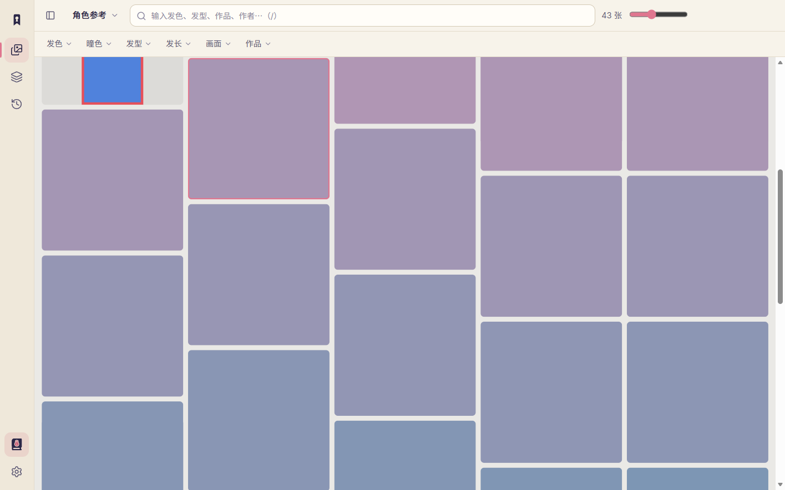

# T01 same-sample evidence

Formal native result: **passed**, built from0069dc8d61762a3be94486671be86d92c0c6f1b5; harness recorded HEADc1eab3d7f1a17db33d5ed9425d296abaa85937d9. Production/runtime source differences between those commits are empty. Final T02 integration happened afterward and passed the frontend/public-core/Clippy checks in checks.json; it is not claimed as a second native run. Historical accepted prototype: **comparison-completed**, source bd8aea44c4a311571ee3c07382cb7755f87f3153; its actual limitations are in prototype-report.json. Initial CSS viewport1281×801 and DPR1.1041666269302368 match exactly. Formal WebView uses the observed DPR without override. Only headless prototype uses a matching DPR test override. Physical Windows DPI/human acceptance remains unverified.

The 43 redistributable PNG fixtures are generated by e2e/spec78-frontend.mjs. Original-file SHA-256 and dimensions are in sample-manifest.json. Native creation/import/folder/search operations use a real temporary SQLite/files library; pins are real native windows.

| Stage | Formal | Accepted prototype |
|---|---|---|
| Steady browse, import report dismissed |  |  |
| Same2400×1600 grid image, medium-gray background |  |  |
| Scrolled, sidebar collapsed |  |  |

The first-visible comparison anchor moves in the historical prototype during collapse because it prioritizes the focused card, then returns on expand; the formal app retains its anchor. Its reveal-on-return also changes scroll720→561.5094604492188 for a fully visible edge card; formal scroll/focus stays at720. The prototype resize stages show actual headless rounding1051×801→1052×802 and1281×801→1283×802. These are recorded, not counted as formal-app failures or hidden by source edits.

initial/ preserves the pre-correction screenshots showing missing size/count/corners and the import obstruction. diagnostics/ preserves the strict headless resize assertion failure. The final report uses explicit comparison limits. Artifact hashes, binary hash, source commits and environment/isolation details are in provenance.json and runtime-inventory.json.
