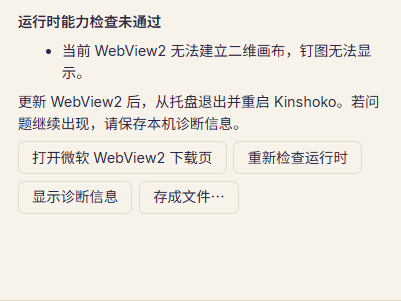

# #78 T18 / #96 Windows 运行时能力

本单实现故事 51。起点为 `152e652311b7c70425f707faece7253ea6f76872`。分支为 `codex/spec-78-t18`。本单不继承 #42／#71 的通过状态。

## 行为与范围

正式主窗口、设置和钉图共用能力提示与本机诊断入口。界面沿用已认可原型的正式侧栏和设置结构；原型只作体验参考。新增检查使用内置 1×1 PNG、生产钉图 renderer 和白色像素读回。检查不读取用户原图，不持久保存能力日志，不上传。

必要能力来自现有生产路径：`HTMLImageElement.decode` 负责钉图源图解码，二维画布负责钉图绘制。缺少接口、实际样本失败与解码超时有各自原因。无法建立画布时，钉图仍执行 `pin_ready`，显示错误与恢复入口，避免窗口一直隐藏。

float16 是可选后备存储。运行时拒绝 float16 或新的 context 选项时，renderer 使用 8 位或默认二维画布。`createImageBitmap` 与 display-p3 不作为普通浏览的必要条件。界面和报告都明确：基础操作完成、`colorSpace` 或 `colorType` 声明不能证明色彩还原度通过。

更新按钮只打开固定的[微软 WebView2 下载页](https://developer.microsoft.com/en-us/microsoft-edge/webview2/)。页面提供 Evergreen 引导与独立安装程序。程序提示更新后从托盘退出并重新启动。微软说明[已启动的应用需要重新启动才能使用更新后的 Runtime](https://learn.microsoft.com/en-us/microsoft-edge/webview2/concepts/developer-guide)。本单没有下载、安装、退出或自动更新动作。

诊断沿用公开核心 `report_with_runtime`、已有脱敏规则、正式保存对话框和使用者主动操作。新增输入只接受固定能力状态，不接收路径、图片或任意浏览器错误文字。报告区分“本窗口未检查”和实际完成的基础操作。没有新 unsafe，也没有生产测试专用 IPC 或环境覆盖。

最低支持范围按本窗口实际完成的操作说明，不写未经实测的数值版本下限。微软建议[功能检测与平滑回退](https://learn.microsoft.com/en-us/microsoft-edge/webview2/concepts/versioning)；这是实现依据，不是 Kinshoko 的兼容性证明。Windows 10／11 是目标范围。负责人没有 Windows 10 设备或 VM，已接受其未验证状态。

## TDD 与本单检查

原始记录在本物理树 ignored `work/t18/`。下表初始检查属于未冻结的本单工作区，不能归给后续提交。

| 行为 | 有效 RED | GREEN |
| --- | --- | --- |
| float16 选项抛错后仍可 8 位绘制 | `renderer-fallback-red.txt` | `renderer-fallback-green.txt`，renderer 10/10 |
| context 新字典被拒绝后仍使用默认二维画布 | `renderer-default-red.txt` | `renderer-default-green.txt`，3 文件 13/13 |
| 未测能力不能从 OS／WebView 版本推断 | `runtime-unknown-red.txt` | `runtime-unknown-green.txt`，核心诊断 7/7 |
| 缺少必要画布的报告含真实原因 | `runtime-report-red.txt` 为公开 API 尚缺失的编译 RED | `runtime-report-green.txt`，核心诊断 8/8 |
| 必要能力失败的界面、更新入口与本机诊断 | `runtime-ui-red.txt` 为组件尚缺失的 RED | `runtime-ui-green.txt`，定向 26/26 |
| 缺少画布的钉图显示错误并提交 ready | `pin-runtime-red-clean.txt` | `pin-runtime-green.txt`，5 文件 28/28 |
| 设置遮罩内保留失败原因与恢复动作 | `settings-recovery-red.txt` | `settings-recovery-green.txt`，4 文件 29/29 |

`pin-runtime-red.txt` 缺少 Tauri 窗口夹具，不能算产品 RED。`pin-runtime-red-behavior.txt` 同时有清理错误；修正夹具后另存真实行为 RED，没有覆盖原件。绑定由 ts-rs 生成，`bindings.txt` 192 个导出通过。合入 T15 后又真实生成 193 个导出；两份运行时绑定仅修正 Rust 文档产生的空白和可用版本查询说明，没有手改生成文件。

工作区 TypeScript 与 strict clippy（core + Tauri all-targets，jobs=2）已执行，原件为 `typecheck.txt` 和 `clippy.txt`。前端完整一轮 `ui-full.txt` 为 272/273，失败是 `TagOrganize.test.tsx:472`。独立文件 `tag-organize-isolated.txt` 为 11/11。原因仍未确认；可能涉及延迟词表通知清除刚打开的 picker。没有改测试等待来隐藏候选体验问题。最小顺序和代码位置保留在 `work/t18/tag-organize-observation.md`，供最终组合复核。

## 固定来源与原生证据

初始原生产品包来自 clean `df647d279becc2a833f4f6ece46ca46893e7fc5d`，tree `217faff3c0858e2c8dff47a669986953bf2f60c3`，EXE SHA-256 `e33b7fcbffa1840a866cf6936f9bafb12e4463b5a1b146821fdc0390f311524a`。清单记录 541 个源码输入、10 个 dist 文件、driver、DirectML 和配置哈希。后续各轮只改 harness，脚本来源与产品来源分别记录。首次 harness 工作文件未预先复制；事后从匹配的 Git 字节重建，不能称运行前保存的原件。

第八、九轮各完成 22 项后中止。两轮均实际显示了合成原图、正常生产钉图和受控 float16／createImageBitmap 缺失时的 8 位钉图。截图与 Pillow 只证明合成梯度和白边可见。跨域 thumb 源导致直接 getImageData 的 SecurityError 被原样保留；没有改 CORS 或关闭 Web 安全。

两轮错误显示前提由外部 Win32 直接隐藏窗口建立。第九轮持续 5 秒记录 46 次 false。只读依赖定位发现 Tao 缓存 visible 标记的早退路径：外部隐藏可以不更新框架状态。因此，这两轮不能证明生产首次 `.visible(false)` 路径失败。失败原件没有删除或改写。

第十一轮 `1791495651613` 使用自有 WebView profile 的 CDP，记录了真实新钉图 HWND 的初始 IsWindowVisible=false。CDP 自动附加和脚本注册被接受，但受控标记没有出现。注入前提失败，不能记为产品 RED 或错误显示成功。没有继续重试同一 A 方案。

第十二轮 `1791496183701` 是独立 main continuation。产品仍为 df647d2，脚本来自 clean `503956e9f1df4adaf6917ec94c524dd00ee89333`、tree `20297bf0863652032a8944628b34d3ba03db99c7`。该轮实际 28/28 检查完成：当前能力、正式本地保存和脱敏、真实库的 400×300 原图100%、可选能力缺失时继续浏览、必要 canvas／decode 的具体原因、重新检查恢复、原图字节保持。它跳过钉图步骤，不能与其他轮次相加称一轮完整通过。官网按钮只确认正式启动请求没有报错；实际外部浏览器页面显示未验证。

本机实际为 Windows 11／WebView2 154.0.4258.62。运行中的隔离 msedgewebview2.exe 文件版本单独记录；tauri::webview_version 只查询可用版本，不能独立证明运行进程版本。DPR、显示器、ICC、SDR 等诊断只提供本机状态，不能推导色彩通过。

原生各轮使用独立 identifier `dev.kinshoko.spec78t18test`、4618／4619 端口、自有数据与 profile、KINSHOKO_SKIP_AUTOSTART=1。真实 KnownFolder settings 在每轮前后单独记录，未用 APPDATA 覆盖代替证明。第十二轮实际 release 为 2026-10-08T21:54:01.1198091Z：自有进程与端口为空，隔离 settings 不存在。精确强制清理不是托盘退出。

受控 JS 缺失只代表当前 Runtime 中被控制的接口缺失。代表性显示不代替颜色、ICC、HDR 或缩放量化门槛。含系统记忆私人目录的 Save 控件树只保留于本地 ignored 原件；公开材料仅用明确标识的最小派生摘要与已查看截图。

## 合入集成后的检查

已合入 root 明确提供的本机 integration `897ebe13aae8ebff09d92f90f560d675543f4ac3`。clean 检查源为 `83da0065853e44a80bc899812289a80015d07a15`、tree `6c6892f183925a41fec5b456236c1c42c25aca86`。核心诊断 8/8、TypeScript、Rust fmt、core + Tauri all-targets strict clippy（自有 target、jobs=2）、完整 T18 增量空白和 harness 语法均通过。

受影响 UI `postmerge-ui.txt` 为 8 文件 104/105。`App.test.tsx:1114` 在等待任意图片后同步查询回收站按钮；实际 DOM 有 disabled“工作参考（… 张）”，没有该按钮。Wall 的卡片请求与 WorkspacePane 的目录请求是不同异步边界，但未证明该轮具体原因。相同交互独立 1/1（59 skipped）完成；这不证明测试问题或与 T18 无关。没有改等待来掩盖失败。错误命令中的不存在 SharedApprox 路径未执行；正确 `src/search/SharedApprox.test.tsx` 另轮 5/5，不能相加称前轮成功。TagOrganize 的早期 272/273 原件同样保留，交最终组合复核。

B 补验 `1791497038707` 来自 clean83da0065／tree6c6892f1，EXE SHA-256 `ceb8324c24133a26b7d07ec9794195373d2fbda4538ef4e685f708edb3675fd6`，552源码输入／10dist。ignored 隔离配置 SHA-256 `df89674590c12e907cc989bb777e87c13b67f200a6f0920a6ce612fee7b307e7`，只引用 default／desktop，并仅给 pin-* 增加 core:window:allow-hide；生产 capability 文件不变。该轮独立5/5完成：公开 Tauri hide 后同一 HWND16517406 的 native与framework均隐藏；受控canvas缺失并reload后，无production canvas，有具体错误，生产ready使该 HWND 可见。首个可见性观察为4ms true。错误图401×301的原因与四个动作完整可见。它不代表首次脚本初始隐藏或真实旧Runtime。22:09:56.2345307Z实际release后，自有进程／端口为空，隔离settings不存在。

root 在固定83da源码对两个独立响应边界做三轮受控探针，每轮保留1个预期RED和2个成功场景。它证明“任意img可见”不是目录控件就绪的充分条件，但不能回溯确定原104/105当轮的请求顺序。探针笔记SHA-256 `9332fbc44446ba247f81e0119aaffa466b7c59f0090431635542fb707b30b7d3`。据此仅修改 App 测试前提：等待正确库的目录导航，确认回收站计数1且可用，再执行原交互。产品未改，过期token与组影响再确认断言均保留。clean修正源 `deb1da162584184cfecd40530aa7e2370c81a32f`／tree `fbf909e97de754a862f4b85dee030d79cf5cdb3c` 的定向1/1（59 skipped）与原八文件组新一轮105/105通过，types／fmt／完整增量whitespace也通过。原104/105与272/273仍保留。该源码与83da原生包仅差一个测试文件，不能把原生包冒称由修正后的提交构建。

最小派生记录见 [证据说明](evidence/spec78-t18/README.md)、[逐轮 native 摘要](evidence/spec78-t18/native-attempts.json)、[固定检查来源](evidence/spec78-t18/checks.json)、[受控响应探针](evidence/spec78-t18/app-trash-probe.json) 和 [截图来源](evidence/spec78-t18/screenshots.json)。原始 Save 控件树不在公开材料中。

## 历史状态与未验证项

历史 CI `37834445118`（head `545bd589`，实际 checkout `eda6a0b6b8847aec107264518125df633f0c376a`，tree `870cda0403a325547c167b52db88fd51b1e8025c`）在 Server 2022／WebView 131／SwiftShader 上颜色门槛失败 11/34，smoke 5 项成功。根任务保存完整原件 `evidence/ci-37834445118/`，另见 `spec-78-ci-smoke.md`。该环境差异没有证明失败原因；更新提示不能豁免软件缺陷。历史结果不属于本单源码。

较新的历史 CI 对应 head1e8eb709、实际 synthetic checkout `82a0501814888bbd0465b03678e8c260374473be`／tree `b769e51ace895e7632380b24cc4d740ae485fe92`，smoke5完成；颜色34个gated样本仍11失败。CI总状态成功不表示颜色达标，也不属于T18提交。

Windows 10、真实较旧／缺失 Runtime、数值最低支持版本及最终硬件颜色门槛未验证。仓库实际公开但没有 Releases；应用仍处于手动更新阶段，生产公钥为空。本单没有更改可见性、Release、生产签名或自动更新开关。
