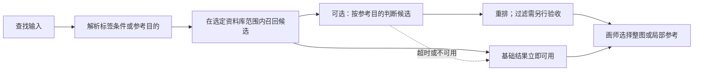

# Jev 与候选用途判断：Kinshoko 适用性评估

初次研究：2026-10-01；复核更新：2026-10-07。评估对象是 [introducing-jev-reranker](https://huggingface.co/blog/hotchpotch/introducing-jev-reranker) 及其背后的按指令做结构化判断的思路。本次补核 OpenAI Decisions API public beta、Jev 当前模型规格与 confidence 定义；第三方 reranker 和社区项目的源码记录仍以初次研究为准，没有重新运行或全面复查。没有注册服务、调用付费 API、安装依赖、上传参考图或元数据，也没有在本项目运行评测。下文的增强用途是研究提案。

证据口径：**文档／源码核查**能确认公开接口和实现；**厂商自报**记录其性能或能力声明，未经本次复现；**本次判断**是接口边界推论。三者不应混为个人资料库上的实测效果。

## 2026-10-07 复核更新

- **OpenAI Decisions API 已成为可直接比较的后端。**官方 changelog 确认 2026-10-06 发布 beta；指南确认 public beta，当前模型为 `gpt-6-luna`，可接收文字与图像，返回 Predicate／Choice／Score 判断。旧多模态笔记中的“尚未确认该接口名称”已在[更新报告](multimodal-decisions-evaluation.md)中修正。[官方发布记录](https://developers.openai.com/api/docs/changelog)、[Decisions 指南](https://developers.openai.com/api/docs/guides/decisions)
- **看图的小判断应优先验证直接多模态路径。**Jev 当前仍只接受文字；原图或现有局部直接进入 Decisions，可以减少临时生成描述的串行步骤。这个流程判断不证明比 Jev 更快或更准；文字与状态已足够的问题仍可比较 Jev。[Jev 输入](https://docs.typesafe.ai/concepts/state)、[Decisions 输入契约](https://developers.openai.com/api/reference/resources/decisions/methods/create)
- **两家的接口与分数要分别处理。**Jev 的 `state`、问题 map、`noul` 和 `criteria`，不能直接当作 Decisions 的 `input`、问题数组、`predicate`、`choices`／`levels`。新实验应固定相同问题、证据和答案空间，为各后端分别构造请求与读取结果。[TypeSafe API](https://docs.typesafe.ai/api)、[OpenAI API](https://developers.openai.com/api/reference/resources/decisions/methods/create)
- **项目范围已有后续决定。**[首版规格 #42](https://github.com/Yukk1No/kinshoko/issues/42)与[技术路线](../discovery/technical-route.md)已确定本地实现；内置近似对应表与个人近似对应表进入首版，Jev 与模型辅助仍在 roadmap（[ADR-0003](../adr/0003-tag-identity-and-approximate-search.md)）。公测开放只改变可验证性，不代表已选定供应商或新增首版能力。

## 评估结论

**按发起者反馈修正定位：Jev 应是需要及时响应的局部语义判断模型，处在纯机械规则与较重模型之间。**不能以高正确率为设计前提，也不能仅凭低价格与结构化输出把批量审核、分类或质量评价交给它。是否值得接入，要看相对规则是否补足了有用的语义判断、相对较重模型是否缩短了等待，以及误判后能否轻松继续操作。更广泛的社区用途及修订后的优先级见 [社区应用评估](jev-community-use-cases.md)。

检索中适合先研究的是已经召回候选后的临时排序或轻提示：原结果先可用，判断在本次交互有效期内返回才应用，错误不裁定图像事实或改变长期元数据。当前 Jev 只有文本输入，其判断仍依赖已有标签、备注或描述。此处是设计约束，不是已经实测的速度或准确率结论。

我们已确认首版的文字与点击标签表达同一组条件，支持中文别名与组合查询；返回整图候选，人物属性关联与自由描述另行验证。主要使用方式是 Windows 本地，自动结果参与检索、人工决定优先。Jev 在 roadmap 中用于从库内已有标签提出近似查找候选；本文讨论的即时意图判断、按用途重排与视觉小判断均是额外研究方向，首版的基础检索仍由标签规则负责。[领域对齐](../discovery/alignment.md)、[Roadmap](../discovery/roadmap.md)

| Kinshoko 场景 | Jev 直接接入的价值与边界 | 本次建议 |
| --- | --- | --- |
| 输入“蓝发、短发”或点击对应标签 | 已知名称与别名可以直接解析。增加概率判断可能让两种入口出现不同结果。 | 优先完成明确、可解释的条件检索；后续可在相同候选中重排。 |
| 含糊的自然语言，例如“想找这种刘海的参考” | 可在预先给出的标签解释或候选描述中判断；缺少示例图片或文字描述时，输入本身不够。 | 作为查询理解实验；输出候选条件，允许用户确认，不自动建立永久别名。 |
| 按绘画用途找图，例如“便于看清发束走向” | 有准确备注或描述时，可按用途重排；普通整图标签可能没有可见程度、遮挡、视角等信息。 | 已有描述可复用且判断赶得上当次查找时，验证临时排序；视觉描述或重模型耗时要算入完整流程。 |
| 自动识别发色、发型、眼睛及区域属性 | Jev 看不到原图；从缺少人物归属的标签列表推导同一人物属性，没有可靠证据。 | 图像识别仍复用专门模型；区域／人物关联单独验收。[标签接口核查](tagger-integration.md) |
| 推荐加入参考组的图或已有参考视图 | 可对有描述的候选给建议，效果取决于能否表达参考目的。 | 后续实验；保存哪些成员及其裁切、布局仍由用户操作和参考组规则决定。 |
| 完全相同原图合并、引用迁移、备份与同步冲突 | 概率判断不满足这些操作所需的身份与保全规则。 | 用明确规则落实已确认的数据行为；冲突建议可以另外评估。 |

更广泛的启发是：把“判断候选的用途”作为可测、可替换的职责，应用自己保存条件、执行流程和处理失败。采用这种职责划分不需要承诺 Jev，也不要求现在训练自己的通用决策模型。

## Jev 与 reranker 是不同层次

Jev 是 TypeSafe 的通用文本决策模型，输入一份 `state` 和多个预先定义答案空间的问题，返回有类型的判断与概率。官方明确说明它不生成回复、代码或推理解释；当前只接受文本、JSON 对象和数组，不接受图像、音频或视频。[System One](https://docs.typesafe.ai/concepts/system-one)、[State](https://docs.typesafe.ai/concepts/state)

`hotchpotch/jev-reranker` 是第三方 Python 封装：输入文字查询与候选文档，调用 Jev API 得分，再排序或按阈值过滤。它不是新训练的图像模型，也不是可下载的 Jev 权重。作者把用途放在检索之后、RAG 组装上下文之前；基础包需要 Python 3.11+ 和 TypeSafe API key。[作者 README](https://github.com/hotchpotch/jev-reranker)

**接口边界推论：**对 Kinshoko 直接送参考图做发型识别，目前没有 Jev 接口支持。若先把参考图转换成标签、备注或描述，再做文字判断，Jev 判断的是这些文字所表达的信息；不能凭这种接入自动获得文字中缺失的视觉事实。

## 输入、输出与分数含义

官方入口是 `POST https://api.typesafe.ai/v1/systemone`，Bearer API key 认证。请求包含 `model`、`state`、`questions`；回复包含模型 ID、按原问题 ID 返回的 `answers` 及 token 用量。问题 ID 本身不参与推理，因此指向候选的含义要写进问题或状态内容。[HTTP API](https://docs.typesafe.ai/api)

| 原语 | 答案空间与返回值 | 使用边界 |
| --- | --- | --- |
| Choice | 预先枚举的选项；返回最高概率选项、完整概率分布、`confidence`；最多 255 个选项。[官方 Choice](https://docs.typesafe.ai/primitives/choice) | 选项之间是相对选择；需表达“都不合适”时应提供相应选项。 |
| Score | 2–10 个按顺序排列的文字等级；返回等级概率、`legend`、加权 `score` 和 `confidence`。[官方 Score](https://docs.typesafe.ai/primitives/score) | 分数范围是 0 到等级数减 1；不是天然的 0–1 概率。 |
| Noul | 是／否问题；返回 0–1 的 `noul`，官方定义为“答案为是”的概率。[官方 Noul](https://docs.typesafe.ai/primitives/noul) | 不另带 `confidence` 字段；应用自行设决策阈值。 |

Score 为等级位置的期望值：`score = Σ(等级序号 × 该等级概率)`。例如三个等级返回 1.4，表示概率加权的位置，不表示“有 140% 的概率合适”。相同均值可能来自不同分布，应该连同原始概率和 rubric 一起解释；模型只看等级描述，不能依靠“比上一档更好”来定义标准。[Score 的读取与等级设计](https://docs.typesafe.ai/primitives/score)

**2026-10-07 修正：官方已公开 `confidence` 的明确公式。**Choice 使用 `(p_max - 1/n) / (1 - 1/n)`，只取最高选项概率与选项数；例如三选项最高概率 0.6 时 confidence 为 0.4，不由其余两项怎样分配决定。Score 使用 `max(0, 1 - Σ p_i × |i-m| / MAD_uniform)`，其中 `m` 是概率最高的等级，`MAD_uniform = Σ |i-(n-1)/2| / n`。Score 因而还计入等级之间的距离。Noul 仍只返回 yes 概率，不附 confidence；如应用另算 `|2p-1|`，应标明这是派生值。[Confidence 公式](https://docs.typesafe.ai/confidence)

这些值都不是独立核实出的正确率。不同选项集、原语、提示、模型版本和供应商下的阈值不能直接移用；尤其不能把 Jev 的公式与阈值套到 OpenAI Decisions 的同名 `confidence` 字段。[Jev 已知边界](https://docs.typesafe.ai/model-jaggedness/jev-1.13)、[Decisions 概率说明](https://developers.openai.com/api/docs/guides/decisions)

TypeSafe 将其训练方法称为 RLCD（Reinforcement Learning for Calibrated Decisions），宣称优化决策概率的校准。官方解释的是**一组预测**中概率与实际频率的对应关系，而不是单次答案保证正确；本次没有得到 Kinshoko 内容上的校准曲线、误差或阈值实验。[AI primer](https://docs.typesafe.ai/introduction/machine-learning-primer)

## 版本、上下文、语言与部署

以下模型规格、输入边界、别名与限制已于 2026-10-07 复核；服务限制可能随后变化。[Models](https://docs.typesafe.ai/models)

| 项目 | 已核实的公开声明 |
| --- | --- |
| 当前版本 | `jev-1.13.0`；`jev-latest` 与 `jev-preview` 当前都指向它。 |
| 版本固定 | 可直接指定版本 ID；别名会移动，回复中的 `model` 可记录实际版本。未核实旧版本保留期限。 |
| 总上下文 | 每次请求 64k token，涵盖 `state` 和所有问题；`state` 加最长单个问题另受 32k token 限制。 |
| 多问题 | 同一状态下各问题独立并行评价；官方建议合并调用，但这不等于无限候选或无批次效应。[并行模式](https://docs.typesafe.ai/patterns/fan-out) |
| 中文／日文 | 英文是主训练语言且当前准确度最好；官方称包括 CJK 在内的其他语言可接受，但准确度较低。未找到中文、日文或中日英混合标签的分项成绩。[State](https://docs.typesafe.ai/concepts/state) |
| 专属训练 | 官方称各账户共享相同权重，不提供用客户数据做 Jev fine-tuning／LoRA 的方式；领域规则经请求传入。 |

**已证实的公开接入路径是云 API。**官方 JS 客户端 `v0.6.0` 的 `systemOne()` 发起 HTTP POST；SDK 公开不等于模型公开。本次在官方模型页、文档索引与官方仓库中没有找到 Jev 权重、本地推理服务或离线部署说明。VPC／私有云／企业专属部署也未找到明确承诺，不能写成已支持或永久不支持；官方明确提供的企业能力是更高配额与另议的数据处理方案。[固定 JS 客户端](https://github.com/typesafe-ai/typesafe-sdk-js/blob/v0.6.0/src/client.ts)、[官方仓库](https://github.com/typesafe-ai)、[文档索引](https://docs.typesafe.ai/llms.txt)

Python 官方包为 `typesafe-sdk`，有同步／异步客户端；JS／TS 包为 `@typesafe-ai/sdk`，文档要求 Node.js 20+。两者默认处理重试，HTTP 接口可由其他语言调用；这不决定 Kinshoko 必须采用哪种技术栈。[Python SDK](https://docs.typesafe.ai/sdk/python)、[JavaScript SDK](https://docs.typesafe.ai/sdk/javascript)、[SDK 总览](https://docs.typesafe.ai/sdk)

## 费用、延迟与吞吐

截至 2026-10-07，标价仍为 **每百万输入 token 0.042 美元**，输出 token 免费；当前限额为 100K token／秒与 **80 请求／秒**（旧稿的 40 已更新）。官方注明限额动态调整且可能不预告变化，超限返回 429。[Models 定价与限制](https://docs.typesafe.ai/models)

按此单价计算，累计 10,000 输入 token 为 0.00042 美元，1,000 次这样的请求为 0.42 美元。这只是算术示例，不是一次 Kinshoko 搜索的预算；实际费用取决于状态、问题、rubric、候选数、拆批和重试的总 token。低单价使有限试验有价值，不能仅凭“收费 API”否定方案。

厂商发布文章自报端到端 70–500 ms，并强调并行采样与 RLCD。这不是本项目用户所在地、候选长度与负载下的延迟保证；本次未测网络 RTT、P50／P95／P99、持续并发、重试和全量候选的耗时。[官方发布文章](https://typesafe.ai/blog/introducing-system-one-models-and-jev)

官方工作流评测以四种自动化任务为例，参考标签来自两个大模型的结果共识，并假定 harness 正确。它可以说明厂商测试的方法和任务形状，不能代替画师确认的参考图检索标注，也不能据此断言中文绘画任务有相同收益。[官方评测方法](https://evals.typesafe.ai/)

## 数据处理与许可

| 事项 | 公开条款与证据边界 |
| --- | --- |
| 输入上传 | 云调用把请求文本交给 TypeSafe。隐私政策称收集 prompts、data、instructions 等 Input，服务托管在美国。[隐私政策](https://typesafe.ai/legal/privacy-policy) |
| 模型训练 | 官方 Models 称不以客户请求／回复训练；隐私政策承诺不以 Input 训练或微调。MCA §4.1 的合同措辞是未经客户事先同意不把 Customer Data 纳入修改模型权重的训练集。[Models](https://docs.typesafe.ai/models)、[隐私政策](https://typesafe.ai/legal/privacy-policy)、[MCA](https://typesafe.ai/legal/mca) |
| 普通保留 | 隐私政策与 DPA 使用“达到处理目的所需时间”等条件，没有固定的 0／7／30 天保证。不能把“不训练”理解为“不留存”。[隐私政策 Retention](https://typesafe.ai/legal/privacy-policy)、[DPA Schedule I](https://typesafe.ai/legal/data-processing) |
| 零保留 | 文档称企业客户可另议 ZDR；本次未取得其覆盖字段、例外、删除时间和价格。[Legal](https://docs.typesafe.ai/legal) |
| 其他处理 | MCA §4.1／4.3 涉及计费、滥用监测、法定义务及 telemetry；telemetry 包括技术日志、哈希、统计与分类，可用于改善服务。公开条款不等于本次审计了真实服务器行为。[MCA](https://typesafe.ai/legal/mca) |
| 软件许可 | 官方 Python SDK、JS SDK 与作者 reranker 仓库声明 MIT；该软件许可不能替代 Jev 服务条款或授予模型权重许可。[Python LICENSE](https://github.com/typesafe-ai/typesafe-sdk-python/blob/main/LICENSE)、[JS v0.6.0 LICENSE](https://github.com/typesafe-ai/typesafe-sdk-js/blob/v0.6.0/LICENSE)、[reranker 仓库](https://github.com/hotchpotch/jev-reranker) |
| 服务许可 | MCA §2.2 允许在客户应用中集成 API；§2.3 对转售服务、用服务／输出蒸馏或训练模仿模型等另设限制。若未来涉及训练数据生产，应先核对实际适用协议。本段只是条款摘记。[MCA](https://typesafe.ai/legal/mca) |

上述政策适用于 TypeSafe 直连。本次没有审查代理供应商的处理条款，不能把直连承诺自动套给第三方网关。条款版本：隐私政策 2025-11-19、DPA 2026-04-24、MCA 2026-09-23。

## 可以借鉴的接口思路与尚未证实的事项

TypeSafe 自己发布了 MIT 的 `system-one-adapter-python`：保留 Choice／Score／Noul 风格的接口，改用普通 LLM 后端，并支持自定义 OpenAI-compatible endpoint。这是把“结构化、狭窄判断交给模型，流程与计算交给代码”与 Jev 服务分开比较的一手例子；**兼容接口和把概率归一化，不证明后端已具备 Jev 宣称的校准、速度或准确率。**本次未安装或运行适配器。[官方适配器 README](https://github.com/typesafe-ai/system-one-adapter-python)、[LICENSE](https://github.com/typesafe-ai/system-one-adapter-python/blob/main/LICENSE)

官方 Jev 1.13 资料承认字面理解、数值精度、间接推理、无关长状态和对抗内容的边界，也明确不保证跨原语或正反问题的数学一致性。受限答案结构能减少格式或选项空间错误，仍会有语义误判；“不能幻觉”的宣传不能等同于“检索判断不会错”。[已知失效模式](https://docs.typesafe.ai/model-jaggedness/jev-1.13)

仍未证实：模型参数与完整架构／训练细节、Jev 权重再分发许可、私有部署可行性、服务版本长期保留与 SLA、中文／日文目标领域的概率校准、参考图元数据上传的实际服务行为，以及 Kinshoko 用户找到合适参考的时间是否缩短。公开 API 可调用与官方性能声明均不代表本项目已评测或已选型。

## 原文的实验能证明什么

作者报告的是 `jev-1.13.0` 在 NanoHotpotQA 的 50 个英文问答查询、每次 100 个混合检索候选上的结果；两种 Jev 方法都用 listwise 评分。以下是作者自报，本次未复现。[原文实验](https://huggingface.co/blog/hotchpotch/introducing-jev-reranker)

| 方法 | nDCG@10 | 每次平均保留候选 |
| --- | --- | --- |
| 原始混合检索 | 0.833 | 100 |
| 普通 rerank | 0.969 | 100 |
| relevance filtering，阈值 0.2 | 0.975 | 7.62 |

候选池里的 97 个已标注正例全部保留，另有 3 个正例在重排前就未进入候选池。约 92% 的候选被过滤，只能支持这个实验设置中的保留规模和排序成绩；没有覆盖二次元图片、中文绘画查询或最终找图时间。作者对下游幻觉减少的描述是预期，未做生成效果测量；0.975 与 0.969 的差异也没有附统计不确定性。[原文结果与边界](https://huggingface.co/blog/hotchpotch/introducing-jev-reranker)

需要借鉴的是两个独立问题：**谁应该排在前面**，以及**哪些候选值得交给下一步使用**。源码的 relevance preset 对没有可用问答证据的内容压低分数，并通过文字指令设置分数锚点；这些锚点不会强制变换或校准返回分数。默认标准是回答问题所需的事实，我们若接入，需要把判断标准改成画师的参考目的，并重新验证阈值。[实际指令](https://github.com/hotchpotch/jev-reranker/blob/main/src/jev_reranker/instructions.py)

评测指南还揭示两个容易误读的地方：过滤在候选全部评分之后执行，因此不会省掉这次评分本身的调用；脚本的 `--top-k 10` 会利用标注补齐正例，它测的是受控候选上的重排。默认完整候选模式则保留原候选池，记录召回缺失。我们应分别测初筛漏图和重排漏图，实验中也应单列空结果。[评测协议](https://github.com/hotchpotch/jev-reranker/blob/main/docs/eval.md)

以上第三方代码读取的是研究日的 `main`，未取得不可变提交 ID，不能视为与博客发表时逐字相同的版本。公开 `pyproject.toml` 当次显示包版本 `0.1.2`，正式实验应固定完整提交、实际包版本、模型 ID、指令、批次划分与样本。[包元数据](https://github.com/hotchpotch/jev-reranker/blob/main/pyproject.toml)

## 怎样把思路放进查找流程

下图是后续验证用的职责草案，具体检索方案尚未选定。已确认的标签入口先执行明确条件；自由描述入口要先验收自身的召回能力。

例如，标签记录 `blue_hair / short_hair / 2girls`，只有整图属性，不能支持“蓝发和短发属于同一个人”这一结论。如果查询改为“便于观察短发发束的侧面参考”，有用性还可能取决于头发是否被遮挡、目标区域是否足够清晰。已有准确备注时可做文字判断；这些视觉事实缺失时，应让实验直接使用图片，或先验证描述生成的正确性。二次元专用标签模型与按用途判断承担不同职责。[已核查标签输出边界](tagger-integration.md)

建议先做**只改变顺序**的实验，再评估是否隐藏结果。RAG 把候选交给生成模型时，减少无关上下文有直接作用；我们的下一步是画师看图和裁切，画师可能从一张整体匹配较弱的图中取到好局部，因此过滤标准需要另做用户验证。可以保留查看全部基础结果的入口，低分也不意味着删除参考图。

试验指令可以分别询问“文字材料是否支持目标条件”“描述是否足以评价当前参考目的”，让应用处理证据不足。Jev 的受限结果不会自动提供事实解释或区域坐标；用户界面的匹配依据应来自实际标签、备注或经过验证的视觉证据，不能仅凭一个分数生成貌似可信的说明。

## 其他可比较的实现路径

除了 Jev，可以用同样的实验协议比较下列路径。这些是可获取性和接口核查，不是准确率或速度排名。

| 路径 | 一手资料支持的能力 | 对 Kinshoko 的适配判断 |
| --- | --- | --- |
| 本地标签、别名与规则排序 | 应用能够直接执行已确认条件，并利用有效标签与人工整理信息。 | 必备基线；先确认复杂模型相对它有多少实际增益。 |
| OpenAI Decisions API，`gpt-6-luna` | 2026-10-06 已发布 beta，接收文字与内联图像，返回专门的三类判断；其标准价为输入 $0.10／百万 token，输出不收费。它是云服务，不是开放权重。[指南](https://developers.openai.com/api/docs/guides/decisions)、[Decisions 定价](https://developers.openai.com/api/docs/guides/decisions#pricing-and-availability) | 对必须看图的即时小问题，优先验证直接判断候选局部；图像准备、上传、拒绝和误判均计入完整流程。详见[接口与对照评估](multimodal-decisions-evaluation.md)。 |
| 本地文字决策模型，例：Bekko System One v0 | 同一作者于 2026-09-30 发布 17M／68M／400M 英文模型，支持 Choice／Noul／Score 和本地推理。17M 浏览器 ONNX 文件约 29 MB，但不包括运行时和工作内存；作者明确承认泛化明显弱于 Jev。[作者模型卡](https://huggingface.co/hotchpotch/bekko-system-one-v0-17m)、[发布说明](https://huggingface.co/blog/hotchpotch/bekko-system-one-v0-release) | 说明轻量、本地的结构化判断已有开放探索；英文与泛化限制使它目前适合作为研究对照，不能据演示选为中文图库默认方案。 |
| 本地多模态重排，例：Qwen3-VL-Reranker-2B | 官方提供图文配对相关性评分、可定制指令和本地加载示例；模型卡标注 Apache-2.0。官方仓库列出中文、日文支持，并说明用 yes／no token 的概率评价相关性。[模型卡](https://huggingface.co/Qwen/Qwen3-VL-Reranker-2B)、[官方架构与语言说明](https://github.com/QwenLM/Qwen3-VL-Embedding) | 更适合验证原图是否满足参考用途。2B 模型与推理资源需求需实测，不能因支持图像就承诺发型细节、人物归属和局部坐标准确。 |
| 普通模型做有限判断 | TypeSafe 官方适配器提供相似原语与可替换 endpoint，便于比较后端。[官方适配器](https://github.com/typesafe-ai/system-one-adapter-python) | 可用来测结构化判断的价值；开放模型的校准、延迟和本地资源成本需分别评估。 |

初次研究记录的 Qwen 2B 官方仓库文件总量约 4.27 GB，明显需要独立评估下载与运行资源；该数值是文件体积，不是内存或显存要求，本次没有重新核对仓库体积。未核实量化配置、Windows CPU／GPU 延迟与二次元专项成绩。[官方文件目录](https://huggingface.co/Qwen/Qwen3-VL-Reranker-2B/tree/main)

这些路径也说明：可以先复用已有的图文重排能力验证用途，再决定是否需要更小、更专门或结合人工反馈的模型。训练自有通用 System One 模型目前没有足够的领域样本和收益证据支持。

## 对当前建模的影响

以下原为 2026-10-01 的技术建模建议，领域术语沿用根目录 [GLOSSARY](../../GLOSSARY.md)，与[数据与存储模型](../discovery/data-storage-model.md)中区分自动／导入结果和人工决定的方向相衔接。2026-10-07 复核时，本地首版已有[规格 #42](https://github.com/Yukk1No/kinshoko/issues/42)；这里保留的是后续增强应遵守的边界，不重新决定存储或进程方案。

1. **标签事实、机器预测与本次查找评分分开表达。**已确认人工决定优先。用于评分的标签应经过当前有效规则处理，不能把被人工否决的标签重新作为肯定证据。标签预测分数、Jev Noul、Jev Score、向量相似度和其他重排分数各有含义，不应合并成一个通用“置信度”。
2. **保留明确条件与可选偏好的区别。**明确标签条件、库范围及查询逻辑由应用执行。模型可以建议解释或排序，但不能为了高分偷偷放宽条件、搜索其他库、修改标签或建立别名。基础查询已确认多条件默认同时满足，任一条件与排除由用户明确表达；增强沿用该语义。
3. **查找评分属于可重建结果。**可记录查询与条件、参考图身份、输入元数据版本、评分后端与实际模型、rubric 版本、分数类型和批次设置，用于追查结果变化。更新标签或人工决定后，旧评分需要失效；自动标签结果及人工决定仍按资料库元数据保全，原图、整理状态和引用不能依赖一个搜索缓存存在。
4. **整图与局部的评分范围明确。**整图评分不会自动成为某个参考视图的评分。若后续用裁切参与判断，要记录裁切输入与来源状态；参考组成员的裁切和布局仍各自独立。搜索排序也不能成为参考组的长期成员身份。
5. **空结果、证据不足、拒绝与服务失败有不同含义。**未召回候选、候选被低分过滤、材料不足以判断、Decisions 单问题拒绝，以及云服务超时，不能统一显示为“库里没有参考”。增强失败时仍能使用基础检索；没有可靠证据时可以保留候选供人工查看。
6. **云接入的输入范围可选择。**低 token 单价使试验可行，但文本标签与备注也属于用户资料。后端选择和所发送字段应明确；仅发送任务所需内容，本地搜索与资料库操作应保持可独立使用。数据保留和离线限制见前文事实核查。

这些职责和验证要求用于后续实验；实现遵守已确定的本地技术路线，远端增强的调度与输入准备需另定接缝，不能直接给当前纯计算 Search 模块加入网络调用。

## 建议的最小验证

这是后续实验提案，尚未执行。先取约 100–300 张有代表性的参考图、20–30 个真实中文查找任务，由画师标注候选是否可用于目的，并把“标签条件匹配”与“画师愿意拿来参考”分开记录。包括单人、多人、头发遮挡、发色／发型交叉、视角、整图／局部、中文别名、否定或偏好表达，以及库内确实无合适素材的任务。

比较路径：A 为标签与别名基线；B 为同一候选上的规则或原始检索顺序；C 为 Jev 根据有效标签、备注评分；D 为可本地运行的图文重排候选；E 为直接接收相同候选图像或局部的 OpenAI Decisions。先按[多模态小判断实验](multimodal-decisions-evaluation.md)验证一个即时问题，再决定是否扩展到上述样本量。共同候选用于比较重排，完整搜索另测；文字与图像路径取得的证据不同，不能将全部差异归因于模型推理。自由描述需另备召回基线；“同一人物”约束的病例单列，不借一次软评分升级首版承诺。

| 要回答的问题 | 观察方法 |
| --- | --- |
| 是否更快找到可用参考 | 第一张可用参考的名次、选中它的时间，以及建立整图／局部参考的完成率。 |
| 排序是否更贴合用途 | 画师标注下的 nDCG@10、前十项可用比例；按发型、发色、多人、局部任务分别报告。 |
| 是否漏掉值得看的图 | 分别计算初筛召回率、过滤后正例保留率、空结果率；记录缺失原因。过滤比例只作规模信息。 |
| 结果是否稳定可解释 | 中文别名与点击标签得到的候选一致性；元数据缺失、候选乱序、不同拆批和版本变化下的结果。 |
| 额外成本是否可接受 | 在用户 Windows 设备上测首次可见结果、增强完成时间、P50／P95、下载与内存；云路径另计实际 token、网络和失败率。 |
| 人工纠错与失败行为是否可靠 | 被否决标签不会重新作为有效匹配依据；断网、超时、全低分和材料不足时仍有明确行为。 |

用一部分任务调指令与阈值，另一部分留作验证；不使用正例补齐来报告完整检索成绩，也不将模型自己给出的高分当作人工真值。可以先在后台记录评分并做盲序比较，实测有稳定找图收益后，再讨论用户可见重排及过滤规格。

进入正式接入讨论的依据应是：在需要及时响应的画师任务上缩短完成操作或找到参考的时间，在本次交互有效期内返回，并保持可承受的误判、纠正与运行成本。要把频繁追加大模型、人工纠正和结果跳动花掉的时间也算进去。若收益主要出现在自然语言或按用途任务，就把能力限定在那个入口；若标签基线已能快速完成任务，则继续优化识别、别名和展示即可。
