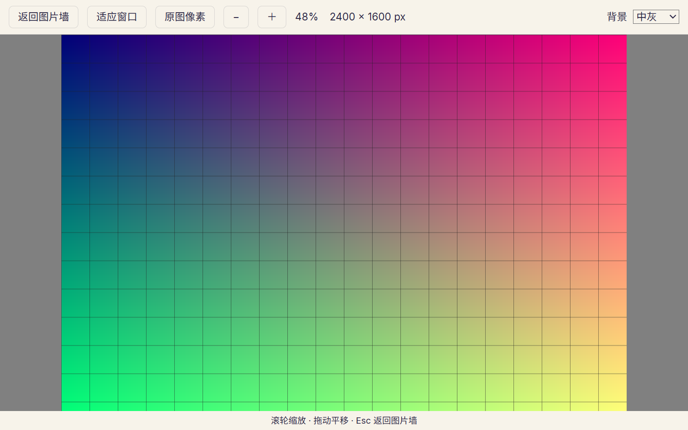

# 原图查看器验证（#47）

2026-10-07。对应 [#47](https://github.com/Yukk1No/kinshoko/issues/47)、[ADR-0005](../adr/0005-two-path-display-pipeline.md) 和[验收约定](acceptance.md)。实现分支为 `ticket/47-viewer`，已合并集成分支中的基础检索与打标功能。

## 使用与显示路径

单击图片墙选中参考图，Ctrl／Shift 保留多选操作；双击或回车打开查看器。整理面板放在侧栏，第一次单击不改变图片墙的位置。滚轮以指针位置为中心缩放，拖动平移；“原图像素”表示一个原图像素对应一个设备像素。Esc 或“返回图片墙”恢复原位置与刚才参考图的焦点。

静态 SDR 在原图像素和放大时直接读取原文件，保留字节、ICC 与 EXIF。缩小时由 Rust 生成精确设备像素宽度的无损 WebP，显示尺寸除以 DPR；图片宽高和相对整个窗口的起点都按设备像素对齐。超过 200% 使用像素插值。连续缩小时等待 120 ms，期间隐藏尚未匹配尺寸的位图，避免 Chromium 缩小旧位图。

窗口变化用 FLIP 连续重排；侧栏宽度变化期间保持布局，结束后按最终宽度重排。自身锚定滚动不会重新捕获锚点。`prefers-reduced-motion` 关闭这些动画。

## 显示路径与 #45 还原度管线

查看器从不直接读原文件，只走 #45 的显示路线（ADR-0005）：

- 1:1 与放大：`Library::display(id)` → `DisplayFile { route: Original | SdrDerivative, path }`，前端 `displayUrl(libraryId, imageId)`（`thumb` 协议 `<资料库 id>/<参考图 id>/full`）。静态 SDR 原图交给 WebView2；动图、HDR、LUT 型 ICC 与 CMYK 换成原尺寸 `sdr` 派生图。
- 缩小（适应窗口等）：`Library::display_scaled(id, 目标设备像素宽度)`，前端 `displayScaledUrl(libraryId, imageId, px)`（`<资料库 id>/<参考图 id>/fit-<像素>`）。目标不小于原图宽度时等同 `display`；更小时由 `kinshoko_core::fidelity::render_sdr` 生成精确宽度的 `sdr` 派生图，与缩略图共用缓存目录和管线版本（`cache/thumbs/<管线版本>/sdr/`），可删除后重建。

派生图的解码、色彩管理、动图首帧与 HDR 判定全部由 `kinshoko_core::fidelity` 负责，查看器不另有实现。安全模式开启（`SafeModeChanged{on:true}`）或查询返回 `UnknownImage` 时，查看器关闭并回到图片墙。

## 自动验证

核心测试通过公开接口，使用真临时 SQLite 和文件。六项测试覆盖：静态 SDR 原图字节不变、精确尺寸与透明色块、缓存重建、EXIF 方向 1～8、三种动画的首帧、常见 HDR 标记在各缩放档的强制派生图分流、无效请求；安全模式测试确认被封印的图 `display`／`display_scaled` 都返回 `UnknownImage`。

前端覆盖 DPR 1／1.25／1.5／2、奇数尺寸、110% 缩放、超过 200% 的插值、工具栏偏移、连续滚轮请求、读取重试、拖动、键盘焦点和图片墙锚点。侧栏 1121→1369→1121 的往返及重复的自身滚动事件不会漂移。

原生冒烟脚本为 [e2e/viewer.mjs](../../e2e/viewer.mjs)，使用 WebView2／EdgeDriver 154.0.4258.53 和 tauri-driver 2.1.0。生成 41 张测试图，在独立应用 identifier、临时资料库及 WebView 用户数据目录运行，不下载模型、不修改开机自启。实测通过：

- 真实双击打开、回车打开和 Esc 返回；滚动到 720 CSS px 后仍保持位置与焦点。
- 适应窗口的解码尺寸等于显示设备像素尺寸；原图像素为 2400×1600，超过 200% 仍使用原图。
- 原图与派生图的起点对齐设备像素；四个随软件附带的字体文件实际加载成功。
- 收起／展开侧栏，原生窗口宽度 1050→1280 往返，同一锚点的偏移变化小于 1 CSS px。
- 开发机实际 DPR 约 1.104，以及 WebView2 的测试参数 DPR 1、1.5。测试参数仅用于本次 WebView2 实例，不改变 Windows 系统缩放。

原生测试同时发现并修复了已有的启动阻塞：在资料库插件的 `setup` 内注册对话框插件会重复等待 Tauri 插件锁，现统一在应用 Builder 注册。



运行方式（PowerShell，独立 identifier 避免与其他实例共用单实例锁）：

```powershell
npm ci
npm run vite:build
$env:TAURI_CONFIG = '{"identifier":"dev.kinshoko.viewer47test"}'
cargo build -p kinshoko --features tauri/custom-protocol
node e2e/viewer.mjs target/debug/kinshoko.exe <msedgedriver.exe> <tauri-driver.exe>
# 可选：只为本次测试设置 WebView2 缩放，另存截图和报告。
$env:KINSHOKO_VIEWER_DPR = '1.5'
$env:KINSHOKO_VIEWER_OUTPUT = 'work/viewer47-dpr15'
node e2e/viewer.mjs target/debug/kinshoko.exe <msedgedriver.exe> <tauri-driver.exe>
```

脚本在输出目录生成 `viewer.png` 和 `report.json`；失败时保存页面和截图。只清理自身创建且已校验路径的临时目录，并由 tauri-driver 的 Windows Job 结束本次测试的子进程。

## 工单验收状态

本工单以开发机上的自动测试和原生验证作为合并前验证。用户机复测只作兼容性记录，不阻塞 #47 合并。用户报告问题时，先对照下表中的未覆盖条件排查。

| 标准 | 已验证 | 兼容性记录（不阻塞合并） |
|---|---|---|
| 1:1／放大的颜色、方向、像素与原文件一致 | 原图不重编码、EXIF 1～8、设备像素尺寸与起点、插值规则 | ICC v2／v4、P3、Adobe RGB、LUT／CMYK、16 位 PNG、gAMA 与透明边缘尚未全面量化；出现颜色问题时对照原文件与屏幕配置 |
| 适应窗口显示派生图 | 核心精确尺寸测试和原生自然尺寸／显示尺寸比较 | 缩小的还原度由 #45 的还原度门槛（`--fidelity-gate`）衡量 |
| 动图与 HDR 全缩放使用 SDR 派生图 | GIF／APNG／WebP 首帧及常见 HDR 标记的分流（#45 管线） | HDR 显示器上的亮度一致性尚未验证 |
| 返回原位置、窗口与侧栏连续重排 | 单元测试和真实 WebView2 锚点、焦点、宽度往返 | 绘王数位板、用户机 Windows 100%／150% 系统缩放与动画观感尚未实测 |
| 随软件附带的字体生效 | Inter 400／500／600、思源黑体实际离线加载，许可随包分发 | 用户机上的中文阅读观感尚未实测 |

本地必须检查的命令为 `npm ci`、`npm run vite:build`、`cargo fmt --all --check`、`cargo clippy --workspace --all-targets -- -D warnings`、`cargo test --workspace`、`npm run bindings`（生成目录无差异）、`npm run typecheck`、`npm test`。原生验证作为额外检查。后续用户机出现问题时，再补充对应样本、GPU、驱动、ICC、HDR、自动色彩管理、系统缩放或输入设备信息，供对照开发机结果定位问题。

以上八项检查均已通过，前端共 41 项、核心查看器共 6 项。Rust workspace 保留集成分支的两项 `ignored`：大库检索性能测量，以及只由故障注入父测试运行的子入口；其余测试均通过。
